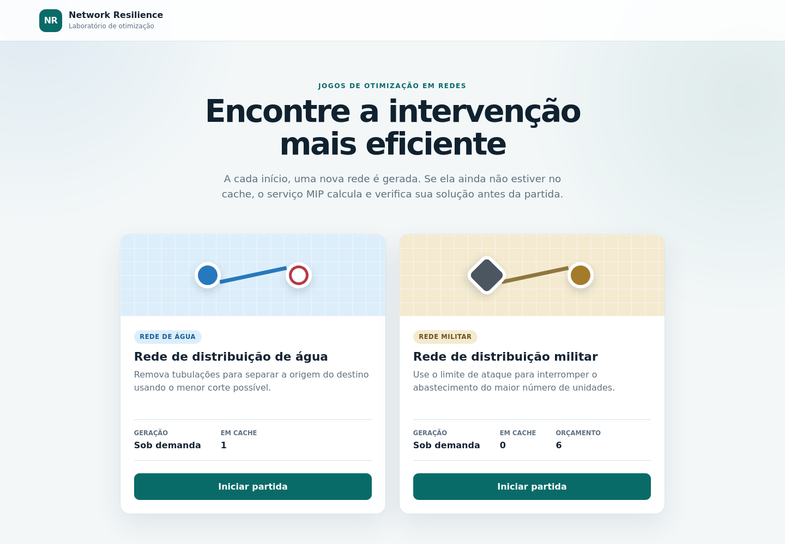
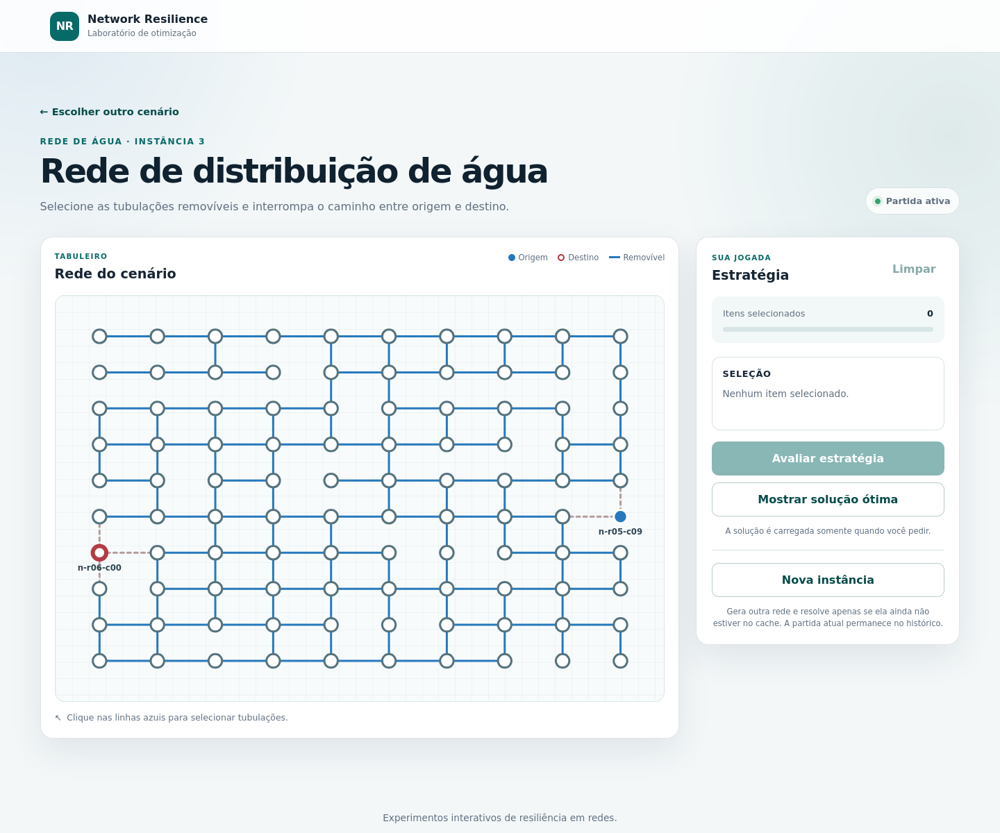
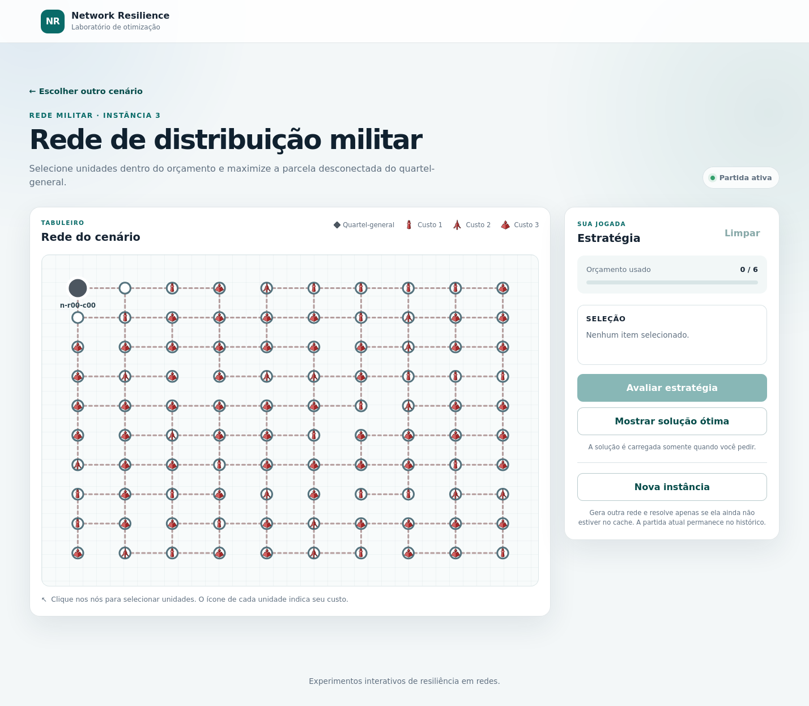

# NETWORK RESILIENCE OPTIMIZATION

An interactive application for exploring network resilience through two optimization problems: cutting water pipes and disrupting military supply networks. Choose a scenario, select interventions and compare your strategy with the optimal solution.

> **Note**: Networks are generated on demand. The optimal solution is computed and verified before each game, reusing cached results when available; moves are evaluated locally. The application uses Django/SQLite and a FastAPI optimization service with Python-MIP/CBC.

## Problems and Mathematical Formulations

Consider a simple, connected, undirected graph $G=(V,E)$, where vertices represent network nodes and edges represent connections.

### Water network: minimum edge cut

**Problem:** remove the fewest pipes needed to eliminate all paths between
the source $s$ and the destination $t$, without removing protected pipes.
Each removal has unit weight; in generated scenarios, pipes incident to
the source or destination are protected.

Let $E_P$ be the set of protected edges. Define $p_v\in\{0,1\}$ as the side
of the cut containing vertex $v$, and $y_e\in\{0,1\}$ as the decision to
remove edge $e$. The model is:

$$
\begin{aligned}
\min\quad & \sum_{e\in E} y_e \\
\text{subject to}\quad
& p_s=0, \\
& p_t=1, \\
& y_{\{u,v\}}\ge p_u-p_v && \forall\ \{u,v\}\in E, \\
& y_{\{u,v\}}\ge p_v-p_u && \forall\ \{u,v\}\in E, \\
& y_e=0 && \forall e\in E_P, \\
& p_v\in\{0,1\},\quad y_e\in\{0,1\} && \forall v\in V,\ e\in E.
\end{aligned}
$$

The constraints require removing every edge between the two sides of the cut, separating the source from the destination.

### Military network: vertex interdiction with a budget

**Problem:** remove units within a budget and maximize the total number of affected units: those removed and those left without a path to headquarters. In generated scenarios, the budget is 6, removal costs are 1, 2, or 3, and headquarters and its neighbors are protected from removal.

Let $h$ be headquarters, $V_P$ the protected vertices, $c_v$ the removal cost of $v$, and $B$ the budget. Define $x_v\in\{0,1\}$ for removed units and $d_v\in\{0,1\}$ for remaining units in the partition separated from headquarters. The model is:

$$
\begin{aligned}
\max\quad & \sum_{v\in V}(x_v+d_v) \\
\text{subject to}\quad
& \sum_{v\in V}c_vx_v\le B, \\
& x_h=d_h=0, \\
& x_v=0 && \forall v\in V_P, \\
& x_v+d_v\le1 && \forall v\in V, \\
& d_u-d_v\le x_u+x_v && \forall \{u,v\}\in E, \\
& d_v-d_u\le x_u+x_v && \forall \{u,v\}\in E, \\
& x_v,d_v\in\{0,1\} && \forall v\in V.
\end{aligned}
$$

A connection between units that have not been removed requires both to be in
the same partition. At optimality, maximization marks all remaining units without
a path to $h$ as disconnected; $x_v+d_v\le1$ prevents counting a unit twice.

If time remains after proving the optimal impact, the solver fixes that value and minimizes $\sum_{v\in V}(c_v+1/(|V|+1))x_v$, favoring lower costs and fewer removals.

## Screenshots

| Scenario catalog | Water network game | Military network game |
| --- | --- | --- |
|  |  |  |

Screenshots are stored in [`docs/`](docs/). Each game lets you evaluate strategies, reveal the optimal solution or generate a new instance.

## Running with Docker

Requires Docker with Compose v2. Prepare the configuration:

```bash
cp .env.example .env
python3 -c "import secrets; print(secrets.token_urlsafe(50))"
```

Copy the generated secret into `DJANGO_SECRET_KEY` in `.env`, then start:

```bash
docker compose up --build -d
```

Open <http://127.0.0.1:8000>. The container prepares the database, static files and scenario catalog automatically. The solver runs on the internal Compose network.

```bash
docker compose logs -f web solver  # follow service logs
docker compose down                # stop, preserving the database
```

## Local Development

Use Python 3.12 and install the dependencies:

```bash
python3 -m venv .venv
source .venv/bin/activate
python -m pip install -r requirements/web.txt -r requirements/solver.txt
```

Start the solver in a terminal with the virtual environment activated:

```bash
uvicorn solver_service.main:app --host 127.0.0.1 --port 8001
```

In another terminal, prepare and start Django:

```bash
source .venv/bin/activate
export DJANGO_DEBUG=true
mkdir -p data
python manage.py migrate
python manage.py seed_scenarios
python manage.py runserver
```

To register and solve deterministic instances in advance:

```bash
python manage.py seed_scenarios --instances-per-kind 6
python manage.py solve_scenarios --time-limit 10
```
